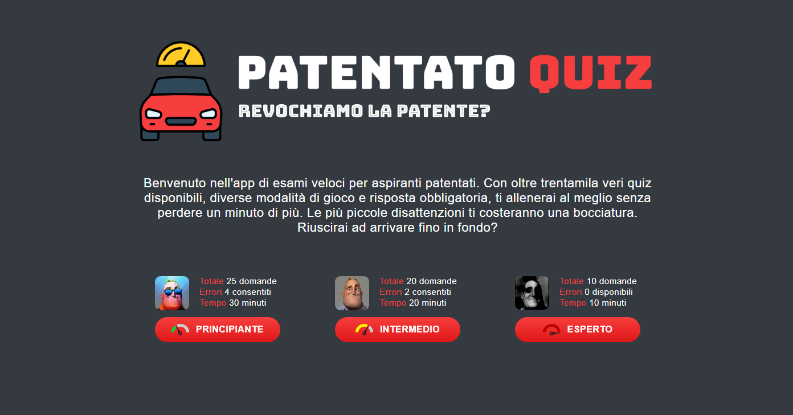
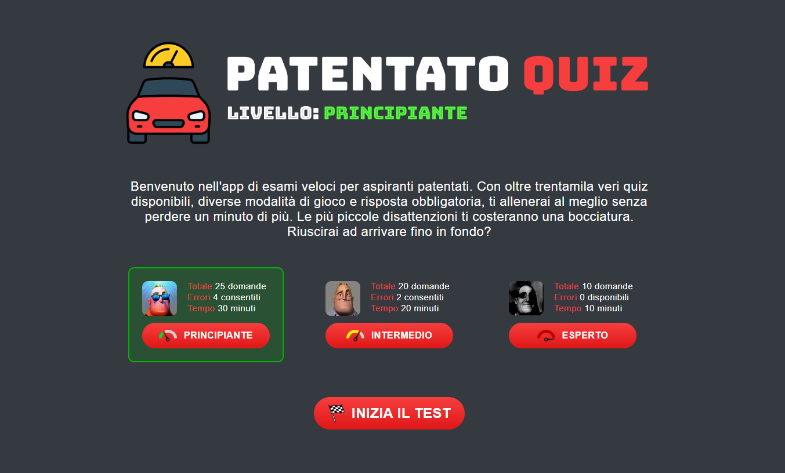
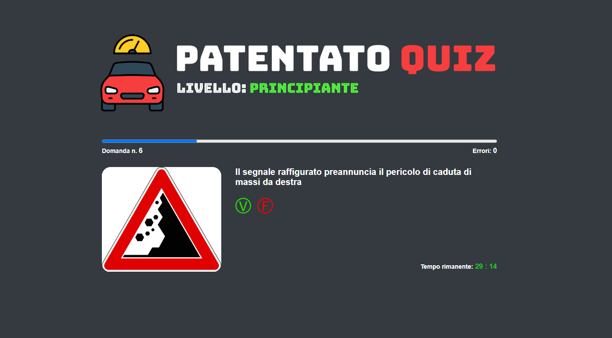
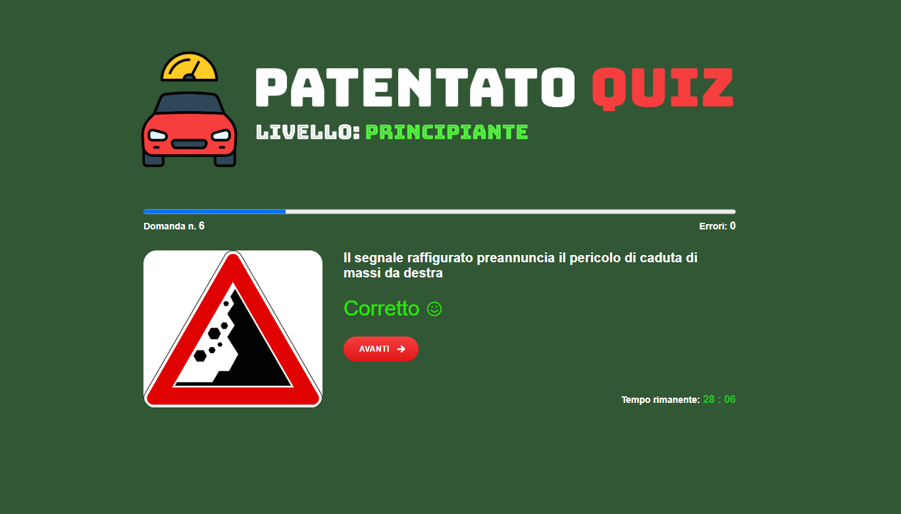
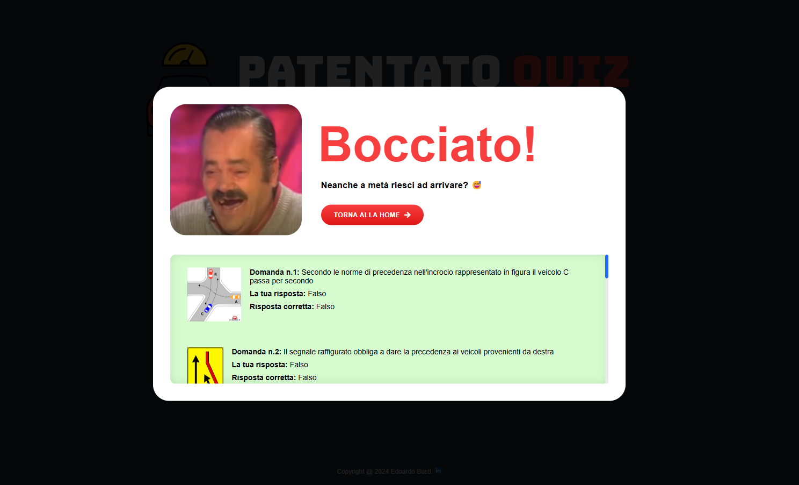

# Italian Driving License Exam Simulator

A React.js web app that simulates an Italian driving license exam. Users can choose from various game modes with customizable settings for the number of questions, allowed errors, and time limits, providing an interactive way to prepare for the test. State management is handled using the useReducer hook, while the Context API facilitates state sharing across components, eliminating prop drilling and ensuring a scalable architecture.

## Features

- **Game Modes**: Users can choose from various game modes with customizable settings such as the number of questions, allowed errors, and time limits.
- **Interactive Quiz**: Simulate the experience of taking the Italian driving license exam with real-time feedback. While playing, users will see a countdown timer, indicating time left for the game, and a progress bar that shows how many questions they have answered, helping them track their pace throughout the quiz.
- **End-Game Results Summary**: In the final results window, users will get a summary of their answers, showing how many they got right or wrong.
- **Dynamic End-Game Feedback**: At the end of the game, users will receive dynamic images and personalized phrases based on their performance. Funny and motivational quotes will also appear to keep the experience engaging and enjoyable.

## Additional Features

- **Reusable Components**: Built modular, reusable components to ensure scalability and maintainability of the app.
- **Custom Hooks**: Created custom hooks to encapsulate logic and improve code reusability.
- **Efficient State Management**: Utilized the `useReducer` hook for managing complex state and the Context API for sharing state across components.
- **No Prop Drilling**: By using Context API, the app eliminates the need for prop drilling, making the architecture more scalable and maintainable.
- **Pixel-perfect design**: Every detail is crafted with precision to ensure a flawless user experience.
- **Responsive layout**: Optimized for all screen sizes, including desktop, tablet, and mobile devices.

## Technologies Used

- **React**
- **CSS3**
- **HTML5**

## Live Version on Netlify

You can view the live version of the project on **Netlify**:

- **Live Demo URL**: [https://patentato-quiz-game.netlify.app](https://patentato-quiz-game.netlify.app)

## Getting Started Locally

This app was bootstrapped using [Create React App](https://github.com/facebook/create-react-app).

### Available Scripts

In the project directory, you can run:

#### `npm start`

Runs the app in development mode. Open [http://localhost:3000](http://localhost:3000) to view it in your browser.

#### `npm test`

Launches the test runner in interactive watch mode.

#### `npm run build`

Builds the app for production to the `build` folder.

#### `npm run eject`

Ejects the app to give you full control over the build configuration (use with caution).

## Learn More

- [Create React App Documentation](https://facebook.github.io/create-react-app/docs/getting-started)
- [React Documentation](https://reactjs.org/)

## License

This project is open-source and available under the [MIT License](LICENSE).

## Screenshots

### Landing Page

### Selected Game Mode

### In-Game Screen

### Answered Screen

### Failed Exam

